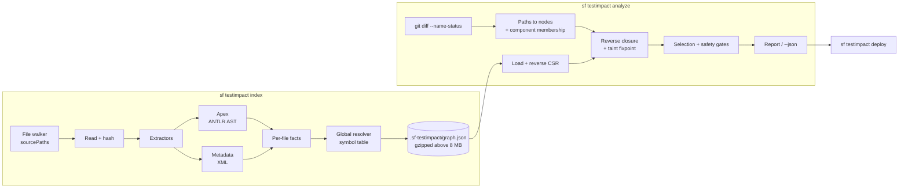

# sf-testimpact

Run only the Apex tests a change set can actually affect, instead of the whole suite.

## The problem

A Salesforce org with a few thousand Apex classes has a full `RunLocalTests` cycle measured
in hours. Every deployment pays it, even a one-line change to a single utility class. Teams
respond by batching changes into large, infrequent releases — the opposite of what CI is
for.

`sf-testimpact` builds a dependency graph of your Apex and metadata, resolves a git diff
into that graph, and computes which test classes could possibly be affected.

Because the output decides **whether tests get skipped**, this is a correctness tool, not a
performance tool. A false negative — a test that would have caught a regression but was not
selected — is a production defect the tool caused. Everything in it is built around one
rule:

> **Over-approximate freely, under-approximate never.** An extra edge costs test minutes. A
> missing edge costs an incident.

Anything unresolvable — dynamic Apex, dynamic SOQL, an unparseable file, an unmodelled
metadata type — widens the result or falls back to running everything, and says so out loud
with the rule that fired.

## Status

Pre-release, `0.1.0`. It has **no users, no installs, and no production deployments**. It
has never been run against a live Salesforce org: `index` and `analyze` are entirely
offline, and the one org-touching path (`deploy --verify-coverage`) has been exercised only
against mocks. The false-negative rate — the headline correctness metric this tool is
designed around — **has never been measured**; see
[Correctness: still unmeasured](#correctness-still-unmeasured).

**At shipped defaults, measured over 30 real commits, this tool selects nothing and runs
your whole suite.** That is a deliberate safety default, not a bug, but it means the tool
delivers no benefit until you change one setting. Read
[Selection quality](#selection-quality) before installing it.

## Install

```bash
sf plugins install sf-testimpact
```

The plugin is not signed by Salesforce, so `sf` asks you to confirm:

```
sf-testimpact isn't signed by Salesforce. Only install the plugin if you trust
its creator. Do you want to continue the installation? (y/N)
```

That prompt has no terminal in CI, where the install exits **13** without installing. Add
the plugin to the allowlist first, then install non-interactively. **The allowlist path is
platform-specific**, and using the wrong one fails silently — the install reports success
and installs nothing:

```bash
# macOS / Linux
mkdir -p ~/.config/sf
echo '["sf-testimpact"]' > ~/.config/sf/unsignedPluginAllowList.json
sf plugins install sf-testimpact
```

```powershell
# Windows
New-Item -ItemType Directory -Force "$env:LOCALAPPDATA\sf" | Out-Null
'["sf-testimpact"]' | Out-File -Encoding ascii "$env:LOCALAPPDATA\sf\unsignedPluginAllowList.json"
sf plugins install sf-testimpact
```

## 60-second quickstart

```bash
cd your-sfdx-project
sf testimpact index                       # build the graph (offline)
sf testimpact analyze --base main         # what would run for this branch?
```

Both blocks below are **verbatim output**, captured from
[trailheadapps/apex-recipes](https://github.com/trailheadapps/apex-recipes) at commit
`2e2c1c3a` (a one-class change), and retained at
[`docs/measurements/quickstart-apex-recipes.txt`](docs/measurements/quickstart-apex-recipes.txt).

**On the shipped defaults:**

```
Changed files: 1  (0238895a...HEAD)

FALLBACK  entry-point-policy-full: QueueableChainingRecipes is an entry point (queueable),
          so its callers may live outside this repository and the graph's inbound edges to
          it are incomplete.
          hint: `entryPointPolicy: widen` selects only the tests that reach an entry point
          of the same kind.
WIDEN     taint-domain-activated-apexType: Taint domain `apexType` activated because
          PlatformEventPublishCallback is impacted.

Running the full suite (RunLocalTests). See the FALLBACK lines above.
```

That is not a failure — it is `entryPointPolicy: full`, the conservative default, doing what
it says. It selects nothing away until you tell it that unindexed callers are not a concern.
Across the 30-commit window measured below, the default falls back **100%** of the time
([Selection quality](#selection-quality)). **The tool only reduces anything once you opt in:**

```yaml
# .sf-testimpact.yml
entryPointPolicy: widen
```

```
Changed files: 1  (0238895a...HEAD)

WIDEN     entry-point-policy-widen: QueueableChainingRecipes is an entry point (queueable).
          Widening to 3 other entry point(s) of the same kind, because an unindexed caller
          may reach the same subsystem through one of them.
WIDEN     taint-domain-activated-apexType: Taint domain `apexType` activated because
          PlatformEventRecipesTrigger is impacted.

Selected 28 of 68 tests (58.8% skipped)
  AccountServiceLayer_Tests
  AccountTriggerHandler_Tests
  AuraEnabledRecipes_Tests
  ... 24 more, listed in full in the artifact
  TestFactory
```

This is one commit, not a typical figure. The measured distribution across 30 commits is in
[Selection quality](#selection-quality), where `widen` averages 26.2% overall reduction.

Read [what `widen` gives up](#configuration) before you set it: it assumes no caller outside
the repository reaches the changed code.

Then deploy with just those tests:

```bash
sf testimpact deploy --base main
```

## Architecture



Extractors are pure `(path, contents) -> facts`. Resolution is global and redone on every
load, so an incrementally built index is identical to one built in a single pass. The query
walks edges *backwards* from the change set, activating taint domains as nodes are reached.
## Benchmarks (measured)

Every number here came from a run against a real public repository. Nothing is extrapolated;
figures that could not be measured say so. Raw output and the scripts that produced it are
in [`docs/measurements/`](docs/measurements/).

**Hardware:** Intel Core 5 120U, 12 logical CPUs, 8 GB RAM, Windows 11, Node 24.19.0.
Single-threaded — the worker pool in the design is not implemented.

**How timings were taken.** Each timed run is a **separate `node` process**, because that is
how the tool is invoked: `sf testimpact index` pays module load, ANTLR parser construction
and a cold JIT every time. Five runs per figure; the table gives the median and the observed
range. The filesystem cache is **warm** and is not dropped between runs — dropping the
Windows page cache needs privileges the harness does not assume — so a first index after a
fresh clone will be slower than these figures. See
[the comparability note](#a-note-on-comparability-with-earlier-figures) before comparing
against any previously published number.

| Repo | License | Commit | Apex classes | Indexed files |
| --- | --- | --- | --- | --- |
| [trailheadapps/apex-recipes](https://github.com/trailheadapps/apex-recipes) | CC0-1.0 | `87c1c9b6` | 139 | 204 |
| [SalesforceFoundation/NPSP](https://github.com/SalesforceFoundation/NPSP) | BSD-3-Clause | `1e9e6190` | 1,035 | 2,470 |

Apex class counts are `.cls` files under each project's `sourcePaths`
([artifact](docs/measurements/benchmark-repo-facts.txt)). NPSP was previously listed as
1,044, which is its repository-wide `.cls` count; 9 of those live outside `force-app` and are
never indexed, so the indexed figure is the one that matches the 2,470.

### Index and query cost

Raw: [apex-recipes](docs/measurements/apex-recipes-timing.json),
[NPSP](docs/measurements/npsp-timing.json), plus the
[index](docs/measurements/apex-recipes-index.json) and
[NPSP index](docs/measurements/npsp-index.json) artifacts for the graph shape.

| | apex-recipes | NPSP |
| --- | --- | --- |
| Full index, median of 5 | **1.42 s** (1.42–1.64) | **20.5 s** (19.8–21.6) |
| Incremental index, 1 class changed | **0.20 s** (0.20–0.22) | **1.85 s** (1.77–1.91) |
| Load graph from disk | 0.019 s | 0.29 s |
| `analyze`, mean per commit | 0.8 ms (30 commits) | 51 ms (1 commit) |
| Index on disk | `graph.json`, 359 KiB | `graph.json.gz`, **1.28 MiB** (8.25 MiB raw) |
| Nodes / edges / taints | 649 / 1,128 / 50 | 7,436 / 42,580 / 2,126 |
| Test classes found | 68 | 396 |
| Files that failed to parse | 0 | 0 |

**Against the design's targets:**

| Target | Result |
| --- | --- |
| Full index, 5,000 classes < 3 min | **Unverified.** Largest measured is 1,035 classes at 20.5 s. Not extrapolated. |
| Incremental index < 5 s | **Met** on both repos — 1.85 s on NPSP — under a warm cache. Cold-cache not measured. |
| `analyze` from a warm graph < 2 s | Met on both repos. |
| `graph.json` < 10 MB at 5,000 classes | Met at 1,035 classes: 1.28 MiB on disk, 8.25 MiB before compression. Unverified at 5,000. |

NPSP's serialised graph is 8.25 MiB, which crosses the 8 MB threshold at which the index is
gzipped, so NPSP is the case that exercises that path rather than a hypothetical one. The
compressed index is **6.5× smaller** than the JSON it encodes.

#### A note on comparability with earlier figures

Earlier revisions of this README quoted different absolute timings. **Those numbers have been
deleted rather than restated: the artifacts that produced them were overwritten, so no
committed evidence supports them.**

What still holds, and matters when comparing against any figure from elsewhere, is the
measurement method, which is stated above: five fresh processes per figure, warm filesystem
cache. Timings taken in-process, or on a cold cache, are not comparable with these and can
differ by a large factor. Cold-cache behaviour has not been measured.

#### The incremental miss: the earlier explanation was wrong

A previous version of this README blamed global re-resolution for the incremental index cost.
**Profiling refutes that**, and the conclusion survives re-measurement. On NPSP, one class
changed ([raw profile](docs/measurements/npsp-incremental-profile.txt)):

| Stage | Time | Share |
| --- | --- | --- |
| read + sha256 every candidate file | **1,386 ms** | 56% |
| load the previous index | 342 ms | 14% |
| walk the source tree | 290 ms | 12% |
| serialise + write | 221 ms | 9% |
| **resolve, globally** | **129 ms** | **5%** |
| extract the one changed file | 91 ms | 4% |

Global resolution — the property the design deliberately paid for, and the thing previously
blamed — is **5%** of the cost, and the floor is I/O: an incremental index must read every
candidate file to prove it is unchanged.

The target is now met, but the reason is the measurement conditions described above, not a
change in this code. The remaining structural cost is still the file scan, and closing it
further needs the parallel file reading that is specified in the design and **not
implemented**. The alternative — trusting size and mtime instead of hashing — would be faster
still and is deliberately rejected: a same-size edit with a preserved mtime would silently
produce a stale fact, and a stale fact is a missing edge.

#### The 4 parse failures were not parse failures

They were four `datasets/` and `scripts/` files
([list](docs/measurements/npsp-unparseable-files.txt)): all four use the `.cls` extension,
all four sit outside `force-app`, and **none has a class wrapper** — they are anonymous Apex
scripts. Three also contain `%%%NAMESPACE%%%` template placeholders. With `sourcePaths` set
correctly the indexer never sees them, and NPSP now reports **0** unparseable files
([artifact](docs/measurements/npsp-index.json)); the 4 comes from the root-walking run
([artifact](docs/measurements/npsp-window.json)).

An earlier revision of this paragraph split them "two templates and two anonymous scripts",
which is wrong on both halves: all four lack a class wrapper, and three carry placeholders.

### Selection quality

30 commits touching `.cls`/`.trigger` from apex-recipes, ending at `87c1c9b6`. The index is
built at each commit, matching how the tool is really run (index your branch, diff against a
base). "Overall reduction" counts a fallback commit as selecting every test, because it does.

| Configuration | Fallback rate | Overall reduction | Tests selected |
| --- | --- | --- | --- |
| **Shipped defaults (`entryPointPolicy: full`)** | **100%** | **0%** | 1,903 / 1,903 |
| `entryPointPolicy: widen` | 46.7% | **26.2%** | 1,405 / 1,903 |
| `entryPointPolicy: strict` | 46.7% | **26.3%** | 1,403 / 1,903 |

Raw: [defaults](docs/measurements/apex-recipes-window-defaults.json),
[widen](docs/measurements/apex-recipes-window-widen.json),
[strict](docs/measurements/apex-recipes-window-strict.json).

**Shipped defaults still deliver nothing.** The blocker is `entryPointPolicy: full`, which
fired on 16 of 30 commits: apex-recipes is dense with `@AuraEnabled`, `@InvocableMethod`,
`Queueable` and `Schedulable` classes, and `full` runs everything whenever an entry point is
impacted. That policy is the documented conservative default.

The honest summary: **the tool is only useful if you set `entryPointPolicy: widen`**, and
whether `full` should remain the default is a product decision, not a measurement.

#### The LWC/Aura extractor was deleted, and that raised the fallback rate

An earlier revision of this README compared these figures against a previously published
pair. **Those comparison numbers have been deleted: no committed artifact produced them.**
The artifacts they were taken from were overwritten by a later re-run, so the comparison is
not reproducible and is not stated here. What survives is what an artifact still supports.

The deletion itself is recorded. The extractor matched
`(lwc|aura)/**.{js,html,cmp,app,evt}`, and **23** files in apex-recipes match that rule
([list](docs/measurements/apex-recipes-lwc-aura-files.txt)). Those files are no longer
indexed, so a commit touching one is an unmodelled file type and forces a full run. In the
current 30-commit window `unmodelled-file-type` accounts for 8 of the 14 fallbacks under
`widen` ([artifact](docs/measurements/apex-recipes-window-widen.json)).

**The provenance ablation could not have predicted this, and that is a methodological point
worth keeping.** Ablating a provenance class removes its *edges* while leaving its files
*modelled*; deleting an extractor removes both. So a measurement showing "regex edges cost
zero extra tests" says nothing about the fallback rate, which is where file modelling acts.
The magnitude of that effect is not quantified here, because measuring it would require
re-running the window against a build that still has the extractor.

Deleting it was still right, for a structural reason rather than a measured one. Its edges
ran UI → Apex while the query walks backwards, so a changed LWC file could never reach an
Apex test: the tool was answering "this LWC change affects no Apex test" from a model
incapable of answering anything else. A fallback is the honest answer to a question the
graph cannot address.

#### What was fixed, ranked by measured cause

Diagnosis first — all 1,715 changed paths across the 30 commits, classified
([raw](docs/measurements/apex-recipes-fallback-diagnosis.json), ladder:
[raw](docs/measurements/apex-recipes-fix-ladder.txt)). This corrected an earlier claim in this
README that `.cls-meta.xml` was the dominant cause; by commits blocked, static resources were:

| Fix (cumulative) | Commits blocked by an unmodelled file | Marginal gain |
| --- | --- | --- |
| baseline | 27/30 | — |
| + files outside `sourcePaths` ignored | 27/30 | 0 |
| + `-meta.xml` companions resolved | 26/30 | 1 |
| **+ static resources modelled** | **12/30** | **14** |
| + DataWeave | 12/30 | 0 |

- **Static resources are now modelled**, not ignored. A `.resource-meta.xml` declares a
  bundle; files inside the bundle directory resolve to it. Apex reaches one through
  `Test.loadData('X')` or `setStaticResource('X')`, so the dependency is real and is
  extracted. In apex-recipes nothing references the documentation bundles, so changing them
  now selects nothing — a *measured* absence of dependency rather than a decision not to look.
- **`-meta.xml` companions resolve to their component.** Every `.cls` has one carrying
  apiVersion and status, and an apiVersion bump changes how the class executes. It therefore
  seeds the class and selects the same tests a body change would — stronger than ignoring it.
- **Files outside `sourcePaths` are no longer treated as unknown metadata.** CI workflows,
  repository docs and build scripts are not deployable and cannot change Apex behaviour.
- **DataWeave `.dwl` is deliberately still unmodelled.** Apex calls these scripts, so the
  dependency is real; falling back is the safe answer and modelling them showed zero marginal
  benefit on this window. Ignoring them would hide a real signal.

Remaining blockers at 12/30 commits, by occurrences across the window: `.js-meta.xml` (45),
`.js` (10), `.json` (7), `.html` (7), `.css` (3). The first three of those are the LWC files
discussed above.

### Correctness: still unmeasured

The headline metric — does selection ever miss a test that would have caught a regression —
**remains unmeasured**.

Computing it requires per-commit historical Apex test results — the suite passing at `c^` and
failing at `c`. Neither repository benchmarked here publishes those, and no public Salesforce
repository was found that does. Generating them means running the full suite at every commit
against a real org, which this project has never done.

A search for an existing public benchmark for Salesforce change-impact test selection turned
up nothing usable as a substitute. Building one, with generator-recorded ground truth, is
open work that this project has not done.

Until that measurement lands, **treat every reduction figure above as a claim about speed only.
Nothing here is evidence about safety.**

### Ablation: what each part of the graph costs

Every edge records how it was derived and what relationship it represents, so the
contribution of each can be measured by removing it and re-running the selection.
20 apex-recipes commits, `entryPointPolicy: widen`, 908 tests selected at baseline, 8
fallbacks ([raw](docs/measurements/apex-recipes-ablation.json)).

**By provenance — was parsing worth it?**

| Provenance | Edges across window | Extra tests it caused | False negatives prevented |
| --- | --- | --- | --- |
| `ast` (parsed Apex) | 18,046 | **297** | not measurable |
| `xml` (metadata) | 3,440 | 0 | not measurable |
| `widened` (hierarchy) | 0 in this window | 0 | not measurable |
| `regex` | — | — | **class no longer emitted** |

**By edge kind — which relationship does the work?** Provenance cannot answer this, because
every Apex-derived edge shares `ast`. Ablating by kind can:

| Edge kind | Edges across window | Extra tests it caused |
| --- | --- | --- |
| `refType` (a type naming another type) | 10,445 | **295** |
| `soqlRead` | 4,162 | 0 |
| `grants` | 2,800 | 0 |
| `describe` | 1,930 | 0 |
| `dml` | 1,022 | 0 |
| `memberOf` | 600 | 0 |
| `extends` | 220 | 0 |
| `implements` | 207 | 0 |
| `triggerOn` | 60 | 0 |
| `flowTouches` | 40 | 0 |

Almost the whole selection on this repository flows through plain type references: `refType`
alone accounts for 295 of the 297 tests that `ast` costs. Every other kind is redundant with
it *on this window*.

**Redundant is not useless, and a zero here is not a licence to delete.** These figures
measure only what a kind *costs*; the prevention side needs the historical test results that
do not exist. A kind that is redundant on 20 apex-recipes commits can be the only path to a
test on a repository shaped differently — `dml` and `soqlRead` reach SObjects and fields,
which apex-recipes barely changes, while NPSP's graph carries 42,580 edges against
apex-recipes' 1,128. The one class that *was* deleted, `regex`, was removed for a structural
reason — its edges pointed away from the direction the query walks — not because a benchmark
showed a zero.

`xml` measured zero cost here but is retained on the same reasoning: NPSP has 16,995 `xml`
edges, and the class carries the `memberOf` edges an object-level change needs.
## Coverage under `RunSpecifiedTests`

`RunSpecifiedTests` requires **every class and trigger in the deployment to individually
reach 75% coverage**, computed only from the tests actually executed. Org-wide averages do
not save an under-covered class, so "we included a covering test" would be worthless — one
test can leave a class at 20% and fail the deploy.

The property that does hold follows from the closure being *complete*, not *minimal*:

> For every class `C` in the payload, coverage of `C` under the selected test set is
> **identical** to its coverage under `RunLocalTests`.
>
> A test `t` contributes coverage to `C` only by executing lines of `C`, which needs a call
> path `t → … → C`. Every such path is a forward path in the graph. `C` is in the payload,
> so `C` changed, so `C` is a seed of the reverse closure — and the reverse closure yields
> *every* node with a forward path to a seed. Hence `selected ⊇ { t : t covers C }`, and
> tests outside that set contribute zero lines to `C`.

**Selection cannot reduce per-class coverage.** `deploy` verifies this rather than assuming
it, and refuses to proceed if it ever fails.

### Where the argument breaks

It is conditional on the graph's *inbound* edges to `C` being complete:

| Breaker | Mitigation | Residual risk |
| --- | --- | --- |
| A test reaches `C` only dynamically | Taint pulls in dynamically-dispatching tests | Only if the construct is outside our detection table |
| A dynamic construct we do not recognise | none | **Real hole** |
| `entryPointPolicy: strict` | none, by the user's explicit choice | The opt-in exists for this |
| **Tests in the org but not the repo** | none — no static analysis can see them | **The largest hole in practice** |

The last matters most in non-source-tracked orgs, which routinely contain Apex the repo does
not. `deploy --verify-coverage` queries the org for exactly this drift — the only command
that contacts an org, with `@salesforce/core` behind a dynamic import so `index` and
`analyze` cannot.

## Limitations

The full false-negative source table. Seven are unmitigated.

| # | Source | Status |
| --- | --- | --- |
| 1 | Dynamic Apex / dynamic SOQL | mitigated — taint |
| 2 | Invocation from outside the repo (scheduled jobs, REST clients) | mitigated — entry-point taint |
| 3 | Tests depending on live org data | mitigated — `SeeAllData` tests always run |
| 4 | Managed-package behaviour change | **NOT MITIGATED** — no source |
| 5 | Custom Metadata / Custom Setting *records* | **PARTIAL** — repo records indexed; org-side invisible |
| 6 | Trigger execution *order* via handler config | **NOT MITIGATED** — order is org state |
| 7 | Formula fields and validation rules | mitigated — `formulaRef` edges |
| 8 | FLS / sharing changes | **CLAIMED MITIGATED, MEASURED FALSE** — see below |
| 9 | Coupling only through the database | **PARTIAL** |
| 10 | Concurrency and row-lock behaviour | **NOT MITIGATED** — beyond static analysis |
| 11 | Custom labels | mitigated, coarse — all labels share one file |
| 12 | Custom permissions | mitigated for string literals only |
| 13 | Translations | **CLAIMED MITIGATED, MEASURED FALSE** — see below |
| 14 | **Tests in the org but absent from the repo** | **NOT MITIGATED statically** |
| 15 | **A dynamic-dispatch construct outside our detection table** | **NOT MITIGATED** |
| 16 | LWC / Aura calling Apex | **extractor deleted** — LWC files now force a full run |
| 17 | DataWeave `.dwl` scripts | **NOT MODELLED** — forces a full run, which is the safe answer |
| 18 | Static resources | mitigated — bundles and single-file resources modelled, Apex references extracted |
| 19 | **A Flow, Process Builder or permission set changing** | **NOT MITIGATED** — selects zero Apex tests; see below |

### Items 14 and 15 deserve separate emphasis

Every other row either degrades loudly or over-selects. **These two are the cases where the
tool is confidently wrong rather than visibly conservative** — it reports a small, confident
test list and is silently missing something.

- **Item 14 — org-only tests.** The tool reasons over the repository. If the org holds test
  classes the repo does not, the coverage argument is false for that org and nothing in the
  graph reveals it. Use `deploy --verify-coverage`.
- **Item 15 — undetected dynamic dispatch.** Taint covers the constructs in our table. A
  codebase with its own reflection helper — a factory resolving class names through a Custom
  Metadata lookup, say — defeats it silently. There is no diagnostic for a construct we do
  not know about.

### Items 8 and 13: a documented mitigation that measurement disproved

`grants` and `translates` edges point permission-set → class and translation → label, and the
query walks edges *backwards*, so nothing depends on a permission set or a translation.
Verified directly:

```
seed = permset:c.ops   -> []          no tests selected
seed = flow:c.f        -> []
seed = label:c.banner  -> ["SvcTest"]  (labels work: Apex references them)
```

Changing a permission set, a flow or a translation selects **zero** tests — verified
directly against a project containing a Flow whose only action calls an `@InvocableMethod`:
editing the `.flow-meta.xml` selected no test but the always-run `SeeAllData` one, while
editing the Apex the flow calls selected that method's test correctly. The ablation shows
the same from the other side, and now at the level of the individual relationship: removing
all 2,800 `grants` edges and all 40 `flowTouches` edges changes the selection on zero of the
20 commits. The edges are real and useful for reporting blast radius; they do not drive test
selection. Unresolved.

### Other known gaps

- **No worker pool.** Indexing is single-threaded; the design specifies parallel parsing.
- **Never run against a live org.**
- **`alwaysRun` globs do not match backslash paths.** Latent — git emits forward slashes and
  the indexer normalises — but pinned by a test.

## Configuration

`.sf-testimpact.yml` in the project root. All keys optional; unknown keys are **rejected**,
because a typo in a safety setting must not read as "no limit configured".

```yaml
version: 1

# Defaults to packageDirectories from sfdx-project.json. Paths outside these are
# not treated as project metadata at all.
sourcePaths: [force-app/main/default]

alwaysRun:
  - "**/SecurityBaselineTest.cls"

# Rarely needed now that unmodelled companions and out-of-tree files are handled.
excludeFromImpact:
  - "**/*.md"

# Circuit breaker, not an optimiser. Catches the case where a bug collapses the
# graph and the tool reports "2 tests needed" for a 300-file change set.
maxReductionPercent: 95
onExceed: warn          # warn | fail | runAll

# How to treat classes whose callers may live outside the repo.
#   full   (default) run everything. Correct, and measured at a 100% fallback rate.
#   widen  select tests reaching other entry points of the same kind. 26.2% reduction.
#   strict trust the graph. The only setting that can miss a test for a visible reason.
entryPointPolicy: full

taint:
  onParseError: full          # full | widen
  dynamicApex: widen
  dynamicSoql: widen
  unmodelledFileType: full

fullTestLevel: RunLocalTests
```

### Commands

| Command | What it does |
| --- | --- |
| `sf testimpact index [--force] [--root-dir]` | Build/update the graph. Offline. |
| `sf testimpact analyze --base <ref> [--head] [--json] [--fail-on-fallback]` | Report the tests to run. Offline. |
| `sf testimpact deploy --base <ref> [--verify-coverage --target-org] [--dry-run]` | Wrap `sf project deploy start`. Only `--verify-coverage` contacts an org. |

`sf testimpact index` and `sf testimpact` are the same command; the topic root is the
command's real id and `index` is an alias, so either form works.

#### Exit codes

A CI gate is only as good as these, so they are contractual:

| Code | Meaning |
| --- | --- |
| `0` | Ran successfully. **Includes a fallback** — falling back to the full suite is a valid answer, not an error. |
| `1` | Either a hard failure (unreadable config, a git ref that cannot be resolved, a corrupt index), or `analyze --fail-on-fallback` when a fallback fired. |

There is no distinct code for "no changes"; an empty change set selects zero tests and exits
`0`. To make a fallback fail the build, pass `--fail-on-fallback` — nothing else turns one
into a non-zero exit, including `onExceed: fail`, which means "fail the *selection*, run
everything" rather than "fail the process".

#### `analyze --json`

The payload is wrapped by `sf` as `{status, result, warnings}`. `result` is versioned by
`schemaVersion`, currently `1`:

| Field | Type | Notes |
| --- | --- | --- |
| `schemaVersion` | number | Bumped on any breaking change to this shape. |
| `toolVersion` | string | Plugin version that produced the result. |
| `outcome` | `"selected"` \| `"full"` | `"full"` means every test runs. |
| `testLevel` | string | `RunSpecifiedTests`, or the configured `fullTestLevel`. |
| `tests` | `{name, reason}[]` | `reason` is `impacted`, `see-all-data` or `always-run`. |
| `selectedCount` / `totalTests` | number | |
| `reductionPercent` | number | `0` whenever `outcome` is `"full"`. |
| `decisions` | `{level, rule, subject, message, hint}[]` | `level` is `fallback`, `widen` or `info`. |
| `fellBack` | boolean | **Branch on this**, not on `tests.length`. |
| `activatedTaintDomains` | string[] | |
| `coverageGaps` | object[] | Changed classes with no covering test. |
| `range` | `{base, head}` | |
| `changedFiles` | number | |
| `graph` | `{nodes, edges, createdAt, indexedFiles}` | |

On a hard error the process exits `1` and `--json` emits `{name, message, code, actions, …}`
instead, where `code` is the stable error code (`GIT_FAILED`, `CONFIG_INVALID`, …) and
`actions` carries the suggested fix.

## Caching `graph.json`

`.sf-testimpact/` is git-ignored by default. Two supported approaches:

**Cache in CI (default).** Key the cache on a hash of the source tree; on a miss, run a full
index. Keeps the repo clean and avoids merge conflicts on a generated file.

```yaml
# fetch-depth: 0 is NOT optional. actions/checkout defaults to a depth-1 clone, which has
# neither the base branch nor a merge base, and `analyze --base <ref>` then exits 1 with
# "GIT_FAILED: Could not diff <ref>...HEAD". It fails loudly rather than selecting a wrong
# subset, but it does fail.
- uses: actions/checkout@v4
  with:
    fetch-depth: 0

- uses: actions/cache@v4
  with:
    path: .sf-testimpact
    key: testimpact-${{ hashFiles('force-app/**') }}

# The plugin is unsigned, so the install prompts unless it is allowlisted first.
- run: |
    mkdir -p ~/.config/sf
    echo '["sf-testimpact"]' > ~/.config/sf/unsignedPluginAllowList.json
    sf plugins install sf-testimpact
  # On a windows-latest runner the path is %LOCALAPPDATA%\sf instead.

- run: sf testimpact index
- run: sf testimpact analyze --base origin/${{ github.base_ref }} --json > impact.json
```

If you fetch only the base branch rather than the whole history, fetch it unshallowed:
`git fetch --no-tags --prune --depth=0 origin +refs/heads/main:refs/remotes/origin/main`.
A shallow base ref produces `no merge base` and the same exit 1.

**Commit it.** Makes CI fast with no cache step and the graph diffable in review. The cost is
that every branch touching Apex conflicts on a large generated file — on NPSP that is a
1.28 MiB `graph.json.gz`, which is compressed and therefore not diffable at all. Below the
8 MB threshold the index stays plain JSON and does diff. Remove `.sf-testimpact/` from
`.gitignore` if you want this.

The index is written atomically and validated on load: a format-version change, an
apex-parser major-version change, or a changed extractor identity all force a re-index rather
than a silently stale answer.

## Contributing

See [CONTRIBUTING.md](CONTRIBUTING.md). The design and its reasoning are in
[docs/DESIGN.md](docs/DESIGN.md). The one rule: a change that makes the tool select *fewer*
tests needs an argument for why the removed tests could not have caught anything — not just a
benchmark showing the number went down.

## License

MIT — see [LICENSE](LICENSE).
