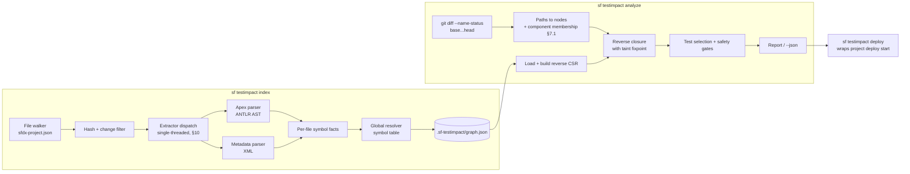

# sf-testimpact — Design

**Status:** Draft for review. No implementation code exists yet.
**Audience:** Reviewers deciding whether to depend on this tool, and contributors.

---

## 1. Problem

A Salesforce org with 5,000 Apex classes typically has 1,500–3,000 test classes and a
full `RunLocalTests` cycle measured in **hours**. Every deployment pays that cost, even a
one-line change to a single utility class. Teams respond by batching changes into large,
risky releases — the opposite of what CI should encourage.

`sf-testimpact` computes which Apex tests can actually be affected by a change set, so a
deployment runs those tests instead of all of them.

The tool's output decides **whether tests are skipped**. That makes it a correctness tool,
not a performance tool. A false negative — a test that would have caught a regression but
was not selected — is a production defect that we caused. Everything below is organised
around making false negatives rare, visible, and measurable, and around degrading to
"run everything" rather than guessing.

**Governing principle:** over-approximate freely, under-approximate never. An extra edge
costs test minutes. A missing edge costs an incident.

---

## 2. Scope

### In scope for v1

| Source | Extraction method |
| --- | --- |
| Apex classes, triggers, interfaces, enums | AST via `@apexdevtools/apex-parser` |
| Custom/standard objects, fields, validation rules | XML |
| Flows (record-triggered, autolaunched, screen) | XML |
| Permission sets, profiles | XML |
| Custom labels, custom permissions, translations | XML |
| Static resources (bundle + Apex references) | XML + AST |

### Out of scope for v1

Each becomes a documented fallback, not a silent gap:

- Managed package internals (no source available).
- Custom Metadata / Custom Setting **records** that drive branching logic.
- Org-side state: scheduled jobs, `CronTrigger` rows, org-wide settings.
- Non-Apex test types (Jest for LWC) — orthogonal, may be added later.
- Cross-repo dependency resolution beyond one sfdx project.

---

## 3. Architecture



Four layers, each independently testable:

1. **Extractors** — pure functions `(filePath, contents) -> FileFacts`. No graph knowledge,
   no I/O, no global state. This is where nearly all the unit tests live.
2. **Resolver** — pure function `(FileFacts[], SymbolTable) -> Nodes + Edges + Taints`.
3. **Store** — serialisation, hashing, incremental invalidation.
4. **Query** — pure function `(Graph, ChangedFiles, Config) -> Selection`.

Dependencies are injected (filesystem, clock, git, logger) so tests are real rather than
ceremonial. Nothing above holds module-level mutable state.

---

## 4. Graph schema

### 4.1 Node identity

Node keys are `<kind>:<namespace>.<normalised name>`. **Apex is case-insensitive**, so the
normalised name is lowercased; the original casing is retained for display only. Getting
this wrong is a silent false-negative source (`AccountService` vs `Accountservice` resolving
to two distinct nodes), so normalisation happens exactly once, at node-key construction.

**Namespace qualification is present from v1** even though v1 supports only one namespace,
so that 2GP multi-package support is additive rather than a graph migration. The namespace
segment is one of:

- the project namespace from `sfdx-project.json`, defaulting to `c` (Salesforce's alias for
  the unmanaged namespace),
- `standard` — reserved for platform types and standard objects (`Account`, `System.*`),
- a managed package prefix (`npsp`), for symbols we have no source for.

Resolution of an unqualified Apex name mirrors the platform: try the project namespace
first, then `standard`. A node whose namespace is neither the project's nor `standard` is
*external* — carried as the `IS_EXTERNAL` flag rather than a distinct kind, so that adding a
second first-party namespace later changes no node kinds.

| Kind | Key example | Declared in a file? |
| --- | --- | --- |
| `apex` | `apex:c.accountservice` | yes (`.cls`) |
| `apexInner` | `apex:c.accountservice.inner` | yes (parent file) |
| `trigger` | `trigger:c.accounttrigger` | yes (`.trigger`) |
| `sobject` | `sobject:standard.account` | only if custom |
| `field` | `field:standard.account.rating__c` | only if custom |
| `flow` | `flow:c.account_after_insert` | yes |
| `permset` | `permset:c.sales_ops` | yes |
| `label` | `label:c.welcome_banner` | yes (shared file, §4.5) |
| `custompermission` | `custompermission:c.approve_refunds` | yes |
| `staticresource` | `staticresource:c.testdata` | yes (`.resource-meta.xml`) |
| managed-package symbol | `apex:npsp.tdtm_runnable` (`IS_EXTERNAL`) | no |

Standard objects and fields are referenced-only nodes: they exist because Apex points at
them, but no file declares them, so they are never invalidated by a file change. They *are*
invalidated by a change to a file that adds members to them (e.g.
`objects/Account/fields/Rating__c.field-meta.xml`), which is owned by that file and lives in
the project namespace even though its parent object does not.

### 4.2 Node record

```ts
interface GraphNode {
  key: NodeKey;                   // "apex:c.accountservice" — identity IS the key
  kind: NodeKind;
  namespace: string;              // "c" | "standard" | managed prefix
  name: string;                   // display casing: "AccountService"
  declaredIn: string | null;      // declaring file PATH, null for referenced-only nodes
  flags: number;                  // bitmask, see below
  testMethods?: string[];         // present when IS_TEST
  entryPoints?: EntryPointKind[]; // present when ENTRY_POINT; drives `widen` (§6.3)
}
```

There is no `id` field. An earlier draft gave each node a dense integer id; the
implementation keys nodes by the string `key` and derives dense indices from a
`Map<NodeKey, number>` built at load time, which the CSR reverse adjacency uses. That is
behaviourally identical and removes a second identity that could disagree with the first.
`declaredIn` is the repository-relative path rather than a file id, because it is compared
directly against what `git diff` reports.

Flags (a bitmask, so the on-disk form stays compact):

| Flag | Meaning | Effect on selection |
| --- | --- | --- |
| `IS_TEST` | `@IsTest` class, or a `testMethod` member | eligible for selection |
| `SEE_ALL_DATA` | `@IsTest(SeeAllData=true)` | implicit `alwaysRun` (§6.4) |
| `IS_ABSTRACT` / `IS_INTERFACE` | type-hierarchy participant | virtual-dispatch widening (§5.3) |
| `IS_GLOBAL` | `global` visibility | entry-point taint (§6.3) |
| `IS_EXTERNAL` | namespace is neither the project's nor `standard` | managed package, no source (§12, item 4) |
| `ENTRY_POINT` | `@RestResource`, `@AuraEnabled`, `@InvocableMethod`, `Schedulable`, `Messaging.InboundEmailHandler`, `@future`, trigger | entry-point taint (§6.3) |
| `PARSE_FAILED` | extractor could not produce facts | hard fallback (§6.5) |

### 4.3 Edges

Edges point **dependent → dependency** ("A uses B"). Impact analysis walks them backwards.

| Edge kind | Source → target | Emitted by |
| --- | --- | --- |
| `extends` | apex → apex | class hierarchy |
| `implements` | apex → apex | interface list |
| `refType` | apex → apex | static type reference, `new`, static call, annotation argument |
| `soqlRead` | apex → sobject / field | SOQL `SELECT` and `FROM` clauses |
| `dml` | apex → sobject | insert/update/delete/upsert, `Database.*` |
| `describe` | apex → sobject / field | `Schema.SObjectType.X`, `getDescribe()` |
| `triggerOn` | trigger → sobject | trigger header |
| `memberOf` | field → sobject | field metadata containment |
| `formulaRef` | field → field | formula and validation-rule field references |
| `flowInvokes` | flow → apex | `<actionType>apex</actionType>` |
| `flowTouches` | flow → sobject / field | record lookup/create/update elements |
| `grants` | permset → apex / sobject / field / custompermission | classAccesses, objectPermissions, fieldPermissions, customPermissions |
| `labelRef` | apex / flow → label | `System.Label.X`, `$Label.X` |
| `permRef` | apex / flow → custompermission | `FeatureManagement.checkPermission('X')` |
| `translates` | translation → label / field | translation file targets |
| `usesResource` | apex → staticresource | `Test.loadData('X')`, `setStaticResource('X')` |

### 4.3.1 Edge provenance

Every edge carries a `provenance` discriminator recording *how confidently* it was derived:

| Provenance | Meaning |
| --- | --- |
| `ast` | from a parsed AST node — the strong case |
| `xml` | from a structured metadata document |
| `regex` | **unused since the LWC/Aura extractor was removed (§12.1).** Retained in the union so an ablation over historical indexes still reports it |
| `widened` | synthesised by hierarchy widening (§5.3) or ambiguity (§5.2 rule 2) |

This is not decoration. It lets `bench/` recompute selection with a provenance class
excluded and report that class's marginal contribution — how many false negatives the
regex extractor actually prevents, and how many extra tests hierarchy widening costs. A
provenance class that prevents no false negatives is a class we can drop. Without this
field those questions are unanswerable, and we would be guessing about our own heuristics.

Note the direction of `memberOf` (field → object). Reversing it during a query means a
change to `Account.object-meta.xml` reaches every field of Account and therefore every
consumer of those fields — deliberately broad, because object-level changes (sharing model,
record types) genuinely can affect any consumer. A change to a *single field*, by contrast,
reaches only that field's consumers. This asymmetry is intended.

There is no `covers` edge. "Test T covers class C" is simply "a forward path exists from T
to C", which is exactly what the reverse closure computes. A separate coverage edge would
be a second source of truth that could silently disagree with the first.

### 4.4 On-disk format — `.sf-testimpact/graph.json`

Columnar, with interned strings, to keep `JSON.parse` off the critical path of an incremental
index. Neither the edge count nor the file size of a 5,000-class org has been measured — the
largest measured project is NPSP at 1,035 classes and 42,580 edges, whose serialised graph is
8.25 MiB before compression ([artifact](measurements/npsp-index.json)).

> **The JSON below is illustrative, not the shipped format.** The persisted artifact stores
> the per-file *extractor facts* — declarations, references, taints, diagnostics — and
> re-resolves them globally on load. It does not store `nodes`/`edges`/`taints`. The
> reasoning is at the top of `src/graph/serialize.ts`: resolution is global in two ways (a
> newly added class makes a reference in an untouched file resolve for the first time, and
> hierarchy widening changes the edges out of every consumer of an interface whenever an
> implementor is added), so patching a stored edge list is unsound. Re-resolving is complete
> by construction and measured at 129 ms on NPSP's 42,580-edge graph
> ([artifact](measurements/npsp-incremental-profile.txt)). The node and edge shapes shown
> here are still exactly what the in-memory graph holds.

```jsonc
{
  "formatVersion": 1,
  "toolVersion": "0.1.0",
  "generator": { "apexParser": "5.2.0", "node": "22.17.0" },
  "createdAt": "2026-09-07T00:00:00.000Z",
  "project": { "root": ".", "sourcePaths": ["force-app/main/default"] },

  "files": [
    { "path": "force-app/main/default/classes/AccountService.cls",
      "hash": "b1946ac9…",       // sha256 of raw bytes
      "parsedOk": true,
      "extractor": "apex@1" }     // extractor identity, see §7.3
  ],

  "nodes": [
    { "id": 0, "key": "apex:c.accountservice", "kind": "apex", "namespace": "c",
      "name": "AccountService", "declaredIn": 0, "flags": 0 }
  ],

  // [src, dst, edgeKind, ownerFile, provenance]
  //   ownerFile  -> incremental invalidation (§4.4 invariant)
  //   provenance -> marginal-contribution analysis in bench/ (§4.3.1)
  "edges": [[1, 0, "refType", 3, "ast"], [0, 7, "soqlRead", 0, "ast"]],

  "taints": [
    { "node": 0, "domain": "apexType", "cause": "Type.forName",
      "at": "AccountService.cls:88:12" }
  ],

  "unresolved": [
    { "ownerFile": 0, "text": "SomeThing.doIt", "at": "AccountService.cls:41:5",
      "disposition": "ignored-local-variable" }
  ]
}
```

**The invariant that makes incremental indexing sound:** every node, edge and taint is
*owned by exactly one file* — the file whose extraction emitted it. Re-indexing file `F` is
therefore: delete everything owned by `F`, re-extract, re-resolve, re-insert. No other
file's records are touched. Referenced-only nodes (standard objects) are owned by no file
and are garbage-collected when their in-degree reaches zero.

The file is written atomically (temp file + rename). `gzip` is applied when the serialised
size exceeds 8 MB (`graph.json.gz`).

`.sf-testimpact/` is **git-ignored** and shipped in the scaffold's `.gitignore`. Committing
it would make CI fast and diffs auditable, but every branch touching Apex would conflict on
a 10 MB generated file. CI instead caches `.sf-testimpact/` keyed on a hash of the source
tree, falling back to a full index on a miss. Both approaches are documented in the README;
only the cache is the default.

### 4.5 Files that own many nodes

The ownership invariant says each node has exactly one owning file — it does not say each
file owns one node. `labels/CustomLabels.labels-meta.xml` declares every custom label in the
project in a single document, and `translations/*.translation-meta.xml` behave similarly.
Incremental invalidation handles this correctly by construction (delete all nodes owned by
the file, re-extract, re-insert), but it has a real consequence for selection: **touching
any label invalidates and re-resolves every label**, so a one-label change appears as a
change to the labels file and impacts every label consumer.

This is over-approximation, which is the safe direction, but it is a notable precision loss
on a file many teams edit constantly. Recorded in §12, item 11 rather than hidden here.

---

## 5. Indexing

### 5.1 Two-pass resolution

Single-pass resolution cannot work: `AccountService` may reference `ContactService`
declared in a file parsed later. So:

- **Pass 1 (parallel, per file):** produce `FileFacts` — declared types, declared members,
  and *unresolved reference tokens* (raw dotted names with source locations). Pure, with no
  cross-file knowledge, and therefore trivially parallelisable across worker threads.
- **Pass 2 (single-threaded, global):** build the symbol table from all declarations, then
  resolve every reference token against it.

Both passes are `O(n·k)` with hash-map lookups. Nothing in the pipeline compares components
pairwise; there is no `O(n²)` step anywhere in the design.

### 5.2 The `A.b.c` problem

Apex gives no syntactic clue whether `A.b.c` is `Class.staticField.member`,
`Namespace.Class.member`, or `localVar.field.field`. Full type inference is out of scope
for v1. The resolver applies these rules in order:

1. If the head identifier binds to a local variable or parameter in scope → **not** a type
   reference. Record it in `unresolved` with disposition `ignored-local-variable`. This is
   the only case where we *drop* a candidate, and it is sound: local scope is fully visible
   in the AST.
2. Else if the head matches one or more known type names → emit a `refType` edge to **every
   match**. Ambiguity produces extra edges, never a choice.
3. Else if the head matches a known SObject or one of its fields → emit `describe` /
   `soqlRead`.
4. Else if the head matches the namespace prefix of an installed package → `external` node.
5. Else the reference is unresolvable: record it in `unresolved` with disposition
   `external-symbol`, and — deliberately — do **not** taint. See the note under §6.2.

Rule 2 is the crux: **ambiguity widens, it never picks**.

### 5.3 Virtual dispatch

A call on a type that is abstract, virtual, or an interface may execute any subtype's
implementation. When a `refType` edge targets a node flagged `IS_INTERFACE` or
`IS_ABSTRACT`, the resolver additionally emits `refType` edges to every known
implementor/subclass. This is bounded by the type hierarchy, computed once per index as a
map, and is the standard over-approximation for a call graph without points-to analysis.

### 5.4 Test → class-under-test

Derived, not declared. A test class is any type with `@IsTest` or a `testMethod` member; its
test methods are recorded for reporting. The classes it exercises are whatever it reaches
through ordinary edges — including via test-data factories and `@TestSetup`, which need no
special handling because they are ordinary references.

`@IsTest(SeeAllData=true)` is different in kind: such a test depends on arbitrary org data
that is not in git. It is flagged `SEE_ALL_DATA` and treated as implicit `alwaysRun`.

### 5.5 LWC / Aura — REMOVED

This section previously specified a regex extractor for
`import doThing from '@salesforce/apex/AccountService.doThing';`. **It was implemented,
measured, and deleted.** §12.1 predicted it would contribute nothing and licensed its
removal; the ablation of §11.2 measured exactly that on a real repository, so the extractor
went rather than being defended.

The reasoning is structural, not incidental. `uiCalls` edges ran UI → Apex while the query
walks edges *backwards* from a change, so a changed LWC file reached no Apex test — and no
Apex test exists that an LWC change could break. The `@AuraEnabled` gap this section claimed
to close is closed by entry-point taint (§6.3) instead.

LWC Jest tests are a different model and remain out of scope (§2).

### 5.6 Labels, custom permissions, translations

- **Labels** — declared in `labels/CustomLabels.labels-meta.xml` (one file, many nodes, see
  §4.5). Referenced from Apex as `System.Label.X` / `Label.X`, from Flows and Visualforce as
  `$Label.X`. Both forms are static and extract cleanly.
- **Custom permissions** — declared per file under `customPermissions/`. Referenced from
  Apex as `FeatureManagement.checkPermission('X')` and granted by permission sets. The Apex
  form takes a **string argument**: a literal yields a `permRef` edge, while any non-literal
  expression is a dynamic reference and taints `apexType` per §6.2. This is the general rule
  for every string-keyed platform API, not a special case.
- **Translations** — `translations/*.translation-meta.xml` and
  `objectTranslations/**`. Edges point at the label or field being translated. Tests that
  assert on user-visible text do depend on these, so omitting them would be a genuine
  false-negative source rather than a harmless simplification.

---

## 6. Taint and fallback rules

This is the safety core of the tool: three escalating levels of degradation.

### 6.1 Level 1 — RESOLVED

A normal edge. No degradation.

### 6.2 Level 2 — WIDENED (taint), unknown *callee*

A node makes a reference whose *target* we cannot determine. We record which **domain** of
the graph the unknown target lives in. At query time, if any node of that domain is
impacted, every node tainted with that domain becomes impacted too.

| Trigger | Domain | Rationale |
| --- | --- | --- |
| `Type.forName`, `Type.newInstance`, `Callable.call` | `apexType` | may instantiate any class |
| `Database.query`, `Database.queryWithBinds`, `Search.query` | `sobjectAny` | may read any object or field |
| `sObj.get('X')` / `put('X', …)` / `getPopulatedFieldsAsMap` | `fieldAny` | may read any field |
| `Test.loadData` / `setStaticResource` with a computed name | `resourceAny` | may load any static resource (§6.4) |
| `System.enqueueJob`, `System.schedule`, `System.scheduleBatch` | `apexType` | same shape as `executeBatch`: the instance may be obtained dynamically |
| `Schema.getGlobalDescribe`, `getGlobalDescribe().get(str)` | `sobjectAny` | enumerates all objects |
| `JSON.deserialize(s, Type.forName(…))` | `apexType` | target type unknown |
| `Database.executeBatch` with a dynamically obtained instance | `apexType` | |
| Unresolvable dotted reference (§5.2, rule 5) | **none — see below** | a fixed external symbol cannot appear in our diff |
| Reference to a managed-package symbol | none (`external` node) | opaque, but versioned separately |

**Why an unresolvable *static* name does not taint.** This rule originally said `apexType` +
`sobjectAny`. The implementation deliberately does not taint, and the code is right: an
unresolvable dotted name is a *fixed* symbol that no file in this repository declares —
almost always a managed-package class. It can never appear in a change set, so it can never
cause a false negative, and tainting it would leave every org with a managed package
permanently and uselessly tainted. It is recorded in `unresolved` with disposition
`external-symbol`, which keeps it visible without poisoning the graph. A *dynamic* reference
is the opposite case, and is what the rest of this table is for.

Crucially, taint is stored as a **property of the tainted node**, not as edges to every node
in the domain. Materialising those edges would be `O(n²)` and is ruled out by our
performance posture. The query-time cost is `O(|tainted nodes|)`.

### 6.3 Entry-point taint, unknown *caller*

The mirror image of §6.2, and the easier one to overlook. Some classes are invoked by
mechanisms that are not in the repository at all: a scheduled job whose class name is a row
in `CronTrigger`, an external REST client, a Process Builder we cannot parse, a
platform-event subscriber, an `@AuraEnabled` method reached through a dynamically built
import.

For these, the graph's *inbound* edges are known to be incomplete, so "only these tests
depend on it" is not a claim we can honestly make. Nodes flagged `ENTRY_POINT` or
`IS_GLOBAL` are handled by an explicit, configurable policy:

- `entryPointPolicy: full` **(default)** — degrade to a full test run. Correct, expensive.
- `entryPointPolicy: widen` — when an entry-point node is impacted, also select every test
  that transitively reaches any other entry point in the same category. Bounded, and covers
  "some other entry point calls into the same subsystem".
- `entryPointPolicy: strict` — trust the graph. Only for teams that have verified their
  invocation surface. Requires explicit opt-in, and is logged loudly on every run.

**`full` is the default because the first run must be trustworthy, not fast.** A tool that
skips tests has to earn that right; a new user's first `analyze` should be visibly
conservative, and teams opt down once the benchmark has convinced them. Concretely, when
this policy fires the output names the rule, the node, and the trade:

```
FALLBACK  entry-point policy: RefundApi is @RestResource — callers may live outside
          this repo, so inbound edges are incomplete. Running RunLocalTests.
          hint: entryPointPolicy: widen selects only tests reaching a REST entry point.
                Faster, but assumes no unindexed caller reaches RefundApi.
```

The hint states what `widen` trades away, not just that it is faster. A user who cannot see
the trade cannot consent to it.

### 6.4 Always-run tests

Selected unconditionally, regardless of the change set:

- config `alwaysRun` glob matches,
- `SEE_ALL_DATA` tests.

**Static resources are no longer an always-run case.** This section used to add "tests
referencing `Test.loadData` or a `StaticResourceCalloutMock` bound to a resource we do not
model". That clause is obsolete in both halves: resources *are* modelled (`staticresource`
nodes, `usesResource` edges), and `selection.ts` only ever always-ran `alwaysRun` globs and
`SEE_ALL_DATA`, so it was never implemented anyway. The two forms are handled precisely
instead:

| Form | Handling |
| --- | --- |
| `Test.loadData(t, 'Seed')` — literal name | `usesResource` edge to that bundle; the normal closure selects the test when the bundle changes |
| `Test.loadData(t, computedName)` — computed | `resourceAny` taint (§6.2); any static-resource change activates it |

The computed case needs the `resourceAny` domain to exist, because a `staticresource` node
otherwise activates no domain and the taint would never fire — a live false negative until
it was fixed.

### 6.5 Level 3 — FULL FALLBACK

The whole run degrades to the configured full-test level.

| Trigger | Why |
| --- | --- |
| A changed file failed to parse (`PARSE_FAILED`) | we do not know what it references |
| A changed file has no extractor and no `excludeFromImpact` match | unmodelled metadata type |
| `graph.json` missing, `formatVersion` mismatch, or extractor identity changed | stale graph |
| A changed file is absent from the graph and not excluded | index is behind the working tree |
| `sfdx-project.json` or `.sf-testimpact.yml` itself changed | indexing assumptions changed |
| `entryPointPolicy: full` and an entry point is impacted | §6.3 |
| Selection exceeds `maxReductionPercent` with `onExceed: runAll` | §8 |

Every fallback is **logged with its trigger, the file that caused it, and the rule that
fired**. Silent degradation is a bug: if the tool decides to run everything, the user must
be able to see exactly why in one line of output.

---

## 7. Query algorithm

### 7.1 Change-set resolution

`git diff --name-status --find-renames <base>...<head>`. Three dots, so the comparison is
against the merge base: the change set is what this branch did, not what also landed on the
base since it forked. `--name-status` rather than `--name-only` because a rename must become
a delete of the old path plus an add of the new one — `--name-only` reports only the
destination, and the old path's nodes must still be seeded or everything that depended on
them is missed. Each path maps to the nodes it declares. A deleted file's nodes
are seeded as changed. An unmapped path consults `excludeFromImpact`, then §6.5.

### 7.2 Reverse closure with taint fixpoint

Reverse adjacency is built as CSR arrays at load time in `O(V+E)`. It is never stored on
disk, because rebuilding it is cheaper than parsing a second index.

```
impacted := seeds                      # nodes of changed files
active   := {}                         # activated taint domains
frontier := seeds

while frontier not empty:
    n := pop(frontier)

    d := domainOf(kind(n))             # apexType | sobjectAny | fieldAny | none
    if d and d not in active:
        active += d
        for t in taintIndex[d]:        # nodes tainted with domain d
            if t not in impacted:
                impacted += t
                push(frontier, t)

    for p in reverseAdj[n]:            # things that depend on n
        if p not in impacted:
            impacted += p
            push(frontier, p)
```

**Why taint must be activated on the impacted set, not on the seed set.** Consider:
`Rating__c` changes; `PricingService` reads it; `Dispatcher` calls
`Type.forName('PricingService')`. The seed set contains only a *field*, so a seed-time check
of the `apexType` domain would not fire, `Dispatcher` would never be reached, and its tests
would be missed — a false negative, from a rule that looks correct at a glance. Activating
domains as nodes are *reached* fixes this.

Termination is guaranteed: each of the (few) domains activates at most once and membership
is monotone, so the loop stays `O(V + E + T)`.

### 7.3 Staleness

Each extractor carries an identity string (`apex@1`), bumped whenever its extraction
semantics change. A graph whose extractor identities differ from the running build is stale
and triggers a full fallback with a clear "re-run `sf testimpact index`" message. The same
applies to `formatVersion` and to the `@apexdevtools/apex-parser` major version — a parser
upgrade can change what we extract, so it must invalidate the index rather than silently
mixing old and new facts.

### 7.4 Selection

```
tests := { n in impacted : IS_TEST(n) }  ∪  alwaysRun  ∪  seeAllDataTests
```

---

## 8. Configuration — `.sf-testimpact.yml`

```yaml
version: 1

sourcePaths: [force-app/main/default]   # defaults to sfdx-project.json packageDirectories

alwaysRun:
  - "**/SecurityBaselineTest.cls"
  - "**/*RegressionTest.cls"

excludeFromImpact:                      # changes here are known-irrelevant
  - "**/*.md"
  - "**/lwc/**/__tests__/**"
  - ".github/**"

maxReductionPercent: 95                 # if we would skip more than this share of tests:
onExceed: warn                          # warn | fail | runAll

entryPointPolicy: full                  # full | widen | strict   (§6.3)
                                        # full is the default: correct before fast

taint:
  onParseError: full                    # full | widen
  dynamicApex: widen
  dynamicSoql: widen
  unmodelledFileType: full

fullTestLevel: RunLocalTests             # used by every fallback path
```

`maxReductionPercent` is a **circuit breaker, not an optimiser**. It exists to catch the
failure mode where a resolver bug collapses the graph and the tool cheerfully reports "2
tests needed" for a 300-file change set. It never *adds* specific tests; it warns, fails, or
escalates to a full run.

---

## 9. Commands

### `sf testimpact index`

`[--force] [--root-dir <path>] [--json]`

oclif derives a command id from its file path, and `commands/testimpact/index.ts` maps to the
topic root, so the real id is **`testimpact`**. `testimpact:index` is declared as an alias
because it is the form this document, the README and the quickstart all use; without it the
documented invocation failed with "Command testimpact:index not found".

Walks `sourcePaths`, hashes every file, re-extracts only changed files, writes
`.sf-testimpact/graph.json` (gzipped as `graph.json.gz` above 8 MB, §4.4). Streams progress
to stderr, suppressed under `--json`. `--force` discards the existing graph.

`--concurrency N` was specified here and is **removed rather than faked**: indexing is
single-threaded, and §10 already records that the parallel file reading it would control is
not implemented. A flag that accepts a number and ignores it is worse than no flag.

### `sf testimpact analyze --base <ref> [--head <ref>]`

`[--json] [--fail-on-fallback]`

Prints selected tests, total tests, reduction %, every fallback and taint that fired, and
any changed Apex class with **no covering test** — a coverage gap worth surfacing
regardless of test selection. `--json` emits a stable machine-readable shape for CI. Exit
code is 0 even on fallback, unless `--fail-on-fallback` is passed.

#### Exit codes

| Code | Meaning |
| --- | --- |
| `0` | Ran successfully, **including a fallback**. A fallback is a valid answer, not an error. |
| `1` | A hard failure (unreadable config, unresolvable git ref, corrupt index), or `--fail-on-fallback` when a fallback fired. |

An empty change set is a success with zero tests selected, not a distinct code.
`onExceed: fail` fails the *selection* — it runs everything — and does not by itself change
the exit code; only `--fail-on-fallback` does.

Errors carry a stable `code` and a `remedy`. The remedy is exposed as `actions`, which is
what `sf` renders in both human output and `--json`; a remedy that is not surfaced there is
not surfaced at all.

### `sf testimpact deploy --base <ref>`

`[--verify-coverage] [--target-org <alias>]`

Wraps `sf project deploy start`, passing `--test-level RunSpecifiedTests --tests …`, or the
configured `fullTestLevel` when any fallback fired. Unrecognised flags pass through.

#### 9.1 Coverage under RunSpecifiedTests — the correctness argument

`RunSpecifiedTests` requires **every class and trigger in the deployment to individually
reach 75% coverage**, computed only from the tests actually executed. Org-wide averages do
not save a single under-covered class. A guarantee of the form "we include at least one
covering test" is therefore worthless: one test can leave a class at 20% and fail the
deploy.

The property that actually holds is stronger, and it follows from the closure being
*complete* rather than *minimal*:

> **Claim.** For every class `C` in the deployment payload, coverage of `C` under the
> selected test set is **identical** to its coverage under `RunLocalTests`.
>
> **Argument.** A test `t` contributes coverage to `C` only by executing lines of `C`, which
> requires a call path `t → … → C`. Every such path is a forward path in the graph. `C` is
> in the payload, so `C` changed, so `C` is a seed of the reverse closure. The reverse
> closure from a seed yields *every* node with a forward path to that seed — it is not
> pruned or minimised. Hence `selected ⊇ { t : t covers C }`. Tests outside that set
> contribute zero lines to `C` by definition, so the executed-line set for `C` is the same
> under both test levels. ∎

**Selection cannot reduce per-class coverage.** That is the guarantee to state, and it is a
consequence of the design rather than an extra safeguard bolted on.

#### 9.2 Where the argument breaks

The claim is conditional on "every such path is a forward path in the graph" — that is, on
the graph's **inbound edges to `C` being complete**. It fails in exactly these cases, and
they must be stated with the claim, not buried:

| Breaker | Covered by | Residual risk |
| --- | --- | --- |
| A test reaches `C` only dynamically (`Type.forName('C')`) | §6.2 taint — the `apexType` domain activates on the changed class `C` and pulls in every dynamically-dispatching test | only if we fail to *detect* the dynamic construct |
| A dynamic construct outside our detection table | nothing | **real hole** — a custom reflection helper we do not recognise |
| `entryPointPolicy: strict` | nothing, by the user's explicit choice | the opt-in exists for this reason |
| **Tests present in the org but not in the repo** | nothing static can see this | **the largest hole in practice** |

The last one deserves emphasis. In a non-source-tracked org — production, a full sandbox —
the org routinely contains Apex the repo does not. Under `RunLocalTests` those org-side
tests execute and contribute coverage to `C`. Under `RunSpecifiedTests` with our list they
do not, and `C` can land under 75% even though the argument in §9.1 is formally valid: the
argument quantifies over tests *in the graph*, and the org's test set is a superset. No
amount of static analysis closes this. It has to be measured against the org.

#### 9.3 `--verify-coverage`

Opt-in pre-flight check against the target org, via the Tooling API. This is the one place an org
connection earns its way into v1, via `@salesforce/core`'s `Org.getConnection()`; `index`
and `analyze` remain fully offline and never open a connection.

1. Query `ApexCodeCoverageAggregate` for every class and trigger in the payload. Refuse to
   deploy, naming each offender and its figure, if any sits under 75%. The deploy would fail
   anyway — failing locally in seconds beats failing after a 40-minute test run.
2. Query `ApexClass`/`ApexTrigger` for test classes present in the org with no corresponding
   node in the graph. These are precisely the §9.2 breaker: their existence means the
   completeness premise is false for this org. Reported as a warning listing the classes,
   escalating to a refusal under `onExceed: fail`.

**Honest limitation:** `ApexCodeCoverageAggregate` reports coverage from the org's *last*
test run. It is a strong signal about classes already sitting near the line, and it detects
repo/org drift exactly, but it does not predict the coverage of the run about to happen.
The command's output says so rather than implying a guarantee it cannot make.

---

## 10. Performance

### Targets — budgets, not measurements

| Operation | Target | Approach |
| --- | --- | --- |
| Full index, 5,000 classes | < 3 min | worker pool at `cpus-1`; parsing is ~95% of the work and is embarrassingly parallel |
| Incremental index, ≤ 20 changed files | < 5 s — **revised, see below** | hash filter + per-file invalidation (§4.4) |
| `analyze` from a warm graph | < 2 s | one `JSON.parse`, `O(V+E)` CSR build, `O(V+E+T)` BFS |
| `graph.json`, 5,000 classes | < 10 MB | columnar layout + string interning |

**No performance numbers are claimed in this document.** The README carries the measured
figures, against named repositories at named commits.

### The incremental target, revised after measurement

The 5-second target assumed the expensive part of an incremental index was the graph work.
Profiling says otherwise. On NPSP (2,470 indexed files under `force-app`), one class changed
([artifact](measurements/npsp-incremental-profile.txt)):

| Stage | Time | Share |
| --- | --- | --- |
| read + sha256 every candidate file | **1,386 ms** | 56% |
| load the previous index | 342 ms | 14% |
| walk the source tree | 290 ms | 12% |
| serialise + write | 221 ms | 9% |
| **resolve, globally** | **129 ms** | 5% |
| extract the one changed file | 91 ms | 4% |

Global resolution — the thing the design traded away speed for, and the thing the README
originally blamed — is **5%** of the cost. The floor is I/O: an incremental index must read
every candidate file to prove it is unchanged.

An earlier revision of this section quoted a different, much slower breakdown and a
before/after pair for a hashing change. **Those numbers have been deleted: the artifacts
behind them were overwritten and nothing in `docs/measurements/` reproduces them.** Getting
below the target on a cold cache would still need the parallel file reading described in this
section, which is **not implemented** — indexing is single-threaded.

The measured incremental index on NPSP is **1.85 s** (median of five fresh processes, warm
filesystem cache — [artifact](measurements/npsp-timing.json)), which meets the 5-second
target under those conditions. Cold-cache behaviour has not been measured, and the profile
above shows the cost is dominated by reading every candidate file, so a cold cache will be
slower by an unmeasured amount.

The alternative — trusting size and mtime instead of hashing — would be faster still and is
deliberately rejected: a same-size edit with a preserved mtime would silently produce a stale
fact, and a stale fact is a missing edge.

### Complexity guarantees

No stage compares components pairwise. Resolution is hash-map lookups; hierarchy widening
uses a precomputed subtype map; taint is a node property with a domain index. The only
`O(E)` work per query is the CSR build and the BFS.

---

## 11. Benchmark harness (`bench/`)

Input: a repo, a list of historical commits, and optionally historical test results.

For each commit `c`: index at `c^`, analyze `c^..c`, and compare against what actually
happened.

### 11.1 Result ingest is a pluggable adapter

```ts
interface TestResultAdapter {
  readonly id: string;                       // "sf-json" | "junit-xml"
  detect(path: string): boolean;             // cheap sniff
  parse(contents: string): TestRunResult;    // -> { commit?, results: TestOutcome[] }
}

interface TestOutcome {
  className: string;
  methodName: string;
  outcome: 'Pass' | 'Fail' | 'Skip';
  durationMs: number | null;                 // null when the format omits it
}
```

`sf-json` (`sf apex run test --json`) ships first; `junit-xml` second behind the same
interface. Adapters are registered in a map, not switched on inline, so a team with a
bespoke CI format adds one file and no core changes. `durationMs: null` is deliberate — a
format without timings must propagate that fact so the harness reports counts only, rather
than silently substituting an average (§11.2).

### 11.2 Provenance ablation

Because every edge carries `provenance` (§4.3.1), the harness re-runs selection with each
provenance class excluded and reports the marginal contribution: false negatives prevented,
and extra tests cost. This is how the LWC extractor and hierarchy widening were judged —
with measurements rather than intuition. The LWC extractor measured zero and was deleted
(§5.5, §12.1); hierarchy widening measured a prevented false negative and was kept.

### Metrics

- **Tests selected vs total**, and reduction %.
- **Estimated minutes saved** — from per-test durations in the historical results when
  available. Otherwise the harness reports test *counts only* and says so. It never
  multiplies by an invented average.
- **False negatives — the headline metric.**

### Defining a false negative correctly

The naive definition ("a test failed at `c` and we did not select it") is wrong. It counts
tests that were already failing at `c^`, and tests that are simply flaky, inflating the
number with failures the change set did not cause.

> A **false negative** is a test that **passed at `c^`**, **failed at `c`**, and was **not in
> `selected(c)`**.

The denominator is the number of such newly-failing (test, commit) pairs — the failures a
perfect selector would have caught. Tests that flip state more than `k` times across the
commit window are classified as flaky and reported in a separate bucket rather than counted
either way; folding them in silently would flatter the score.

The harness also reports **fallback rate** — the share of commits that degraded to a full
run — because a selector that always falls back trivially achieves a zero false-negative
rate and zero value. The two numbers are only meaningful together, so the report always
prints them together.

Output: a table to stdout, plus `bench/results/<repo>-<timestamp>.json`.

---

## 12. Known false-negative sources

Stated plainly, because a tool like this is only trustworthy if its gaps are documented.

| # | Source | Status |
| --- | --- | --- |
| 1 | Dynamic Apex / dynamic SOQL | mitigated — taint (§6.2) |
| 2 | Invocation from outside the repo (scheduled jobs, REST clients) | mitigated — entry-point taint (§6.3) |
| 3 | Tests depending on live org data | mitigated — `SEE_ALL_DATA` always runs (§6.4) |
| 3b | Tests seeding data from a static resource | mitigated — `usesResource` edge for a literal name, `resourceAny` taint for a computed one (§6.4) |
| 4 | Managed-package behaviour change | **not mitigated** — no source. Package version bumps must force a full run; documented in README limitations |
| 5 | Custom Metadata / Custom Setting *records* driving behaviour | **partial** — record files in the repo are indexed; org-side records are invisible |
| 6 | Trigger execution *order* changed via handler configuration | **not mitigated** — order is org state |
| 7 | Formula fields and validation rules | mitigated — `formulaRef` edges (§4.3) |
| 8 | FLS / sharing changes altering behaviour for the running test user | mitigated — `grants` edges (§4.3) |
| 9 | Coupling only through the database (a test asserting on a rollup we did not link) | **partial** — rollup summary fields are indexed; declarative side effects generally are not |
| 10 | Concurrency and row-lock behaviour | **not mitigated** — beyond any static analysis |
| 11 | Custom labels | mitigated — `labelRef` edges. Coarse: all labels share one file, so any label change impacts every label consumer (§4.5) |
| 12 | Custom permissions | mitigated — `permRef` edges from `FeatureManagement.checkPermission('X')` and `grants` from permission sets. **Only for string literals**; a computed permission name taints `apexType` |
| 13 | Translations | mitigated — `translates` edges to the label/field translated. Relevant when a test asserts on a translated value |
| 14 | Tests present in the org but absent from the repo | **not mitigated statically** — detected only by `deploy --verify-coverage` (§9.2, §9.3). The dominant risk in non-source-tracked orgs |
| 15 | A dynamic-dispatch construct outside our detection table (§6.2) | **not mitigated** — a custom reflection helper we do not recognise defeats taint |
| 16 | LWC / Aura calling Apex | **NOT INDEXED — extractor deleted** after measuring zero contribution (§12.1) |
| 17 | DataWeave `.dwl` scripts | **not modelled** — an unmodelled type inside `sourcePaths` forces a full run, which is the safe answer |
| 18 | A **Flow** or Process Builder changing | **not mitigated** — `flowInvokes`/`flowTouches` point Flow → Apex, and §7 walks edges backwards, so a changed flow reaches no Apex test. Structurally the same as row 8 and row 13: nothing in the repository *depends on* a flow. Verified: editing a `.flow-meta.xml` whose only action calls an `@InvocableMethod` selected no test other than the always-run `SEE_ALL_DATA` one |

### 12.1 What the UI extractor bought — and why it was deleted

Item 16 needs stating plainly, because §5.5 overclaimed it. **This prediction has since been
discharged: the extractor was measured, found to contribute nothing, and removed.**

Edges run UI → Apex, and the query walks edges *backwards* from a change. A changed Apex
class therefore reaches the UI components that call it, which is useful for reporting a
deployment's blast radius. A changed **LWC file reaches nothing upward**: Apex tests do not
exercise LWC, so no Apex test is selected by it — and none should be.

The gap §5.5 claimed to close — `@AuraEnabled` methods invoked from outside the graph — is
closed by entry-point taint (§6.3), not by this extractor. Its edges were tagged
`provenance: regex`, and §11.2's ablation measured their contribution as **zero** on a real
repository: they changed the selection on no commit. The extractor was therefore deleted
rather than defended, exactly as this section said it should be.

**Caveat on the evidence.** The ablation run that produced that zero was against a build that
still had the extractor, and its artifact has since been overwritten by a later run. The
current artifact ([apex-recipes-ablation.json](measurements/apex-recipes-ablation.json))
shows `regex` at zero *edges*, which is a consequence of the deletion rather than evidence
for it. The decision also rests on a structural argument that does not need a measurement —
edges pointing UI → Apex cannot be traversed by a query that walks backwards — and that
argument stands on its own. A second limitation, discovered later, is that ablating a
provenance class removes edges but leaves the files *modelled*, so this measurement could
never have shown the effect the deletion had on the fallback rate.

Items 4, 6, 9, 10, 14 and 15 are why `maxReductionPercent` and `alwaysRun` exist. They are
the honest floor of a static approach, and the README will say so.

Items 14 and 15 are the two worth a reader's attention: they are the failure modes where
the tool is confidently wrong rather than visibly conservative. Everything else either
degrades loudly or over-selects.

---

## 13. Repo layout

```
src/
  commands/testimpact/{index,analyze,deploy}.ts   # thin: parse flags, call lib, format
  index.ts                                        # public programmatic API (barrel)
  extract/{apex,metadata,flow,permset,labels,     # pure (path, contents) -> FileFacts
           staticresource,xml,facts,index}.ts
  resolve/{symbolTable,resolver}.ts               # pure facts -> nodes/edges/taints
                                                  # hierarchy widening lives in resolver.ts
                                                  # as widenHierarchy(); there is no
                                                  # separate hierarchy.ts
  pipeline/index.ts                               # walk + hash + extract + persist
  report/json.ts                                  # versioned `analyze --json` shape
  deploy/{plan,coverage,toolingClient}.ts         # deploy args, 75% rule, Tooling API
  bench/{run,adapters,ablation,                   # benchmark harness (not published)
         falseNegatives,report}.ts
  graph/{model,serialize,store,incremental}.ts
  query/{changeSet,closure,selection,safety,analyze}.ts
  config/{schema,load}.ts
  errors.ts                                       # typed errors naming the offending file
  {types,version,paths,project}.ts                # shared types, version constants, helpers
test/                                             # unit + fixture-based integration
test/fixtures/sample-project/                     # a real, small sfdx project
bench/
docs/DESIGN.md
```

### Dependencies

Anything under ~1M weekly npm downloads needs justifying. Figures re-queried from the npm
downloads API on 2026-09-08 and retained at
[`docs/measurements/dependency-downloads.txt`](measurements/dependency-downloads.txt):

| Package | Version | Weekly downloads | Justification |
| --- | --- | --- | --- |
| `@apexdevtools/apex-parser` | 5.2.0 | 51,713 | The only maintained Apex grammar for JS. From Apex Dev Tools (also behind `apex-ls`), ANTLR-generated from the grammar lineage the ecosystem shares. The alternative is writing an Apex parser. One transitive dep (`antlr4@4.13.2`); engines `^20.19 \|\| ^22.13 \|\| >=24`. |
| `@salesforce/sf-plugins-core` | 13.0.4 | 824,438 | Mandated by CLAUDE.md for `sf` v2 plugins; first-party Salesforce. |
| `@salesforce/core` | 9.1.10 | — | First-party auth and connection resolution. |
| `@jsforce/jsforce-node` | 3.10.25 (transitive) | — | Tooling API types for `deploy --verify-coverage` only (§9.3). **Not a declared dependency**: it arrives as `^3.10.24` via `@salesforce/core`, and the connection object is obtained from `Org.getConnection()` rather than by importing it. The package named plain `jsforce` is not in this tree. |
| `fast-xml-parser` | 5.11.1 | 57.8M | Metadata XML. |
| `yaml` | 2.9.0 | 176M | Config file. |
| `picomatch` | 4.0.7 | 435M | Globs for `alwaysRun` / `excludeFromImpact`. |

`@salesforce/core` is loaded lazily, behind the `--verify-coverage` flag — it is the only
thing that opens a connection, and the Tooling API call goes through the connection it
returns. `index` and `analyze` never import it: offline operation is a property worth
preserving, and a dynamic import is what enforces it rather than a comment asking people to
be careful.

### Module format and test runner

`@salesforce/sf-plugins-core@13` is **ESM-only** (`"type": "module"`, engines `>=22`), so
the plugin is ESM/NodeNext throughout. The design's earlier mention of jest is superseded:
Jest requires `--experimental-vm-modules` and a ts-jest ESM configuration that is a
persistent source of confusing failures for contributors. **Vitest** runs native ESM +
TypeScript with no such configuration, so it is used instead. Coverage via `@vitest/coverage-v8`.

### `.gitignore` (scaffold)

`node_modules/`, `lib/`, `.sf-testimpact/`, `.env`, `*.log`, and scratch-org definition
files — per CLAUDE.md, and per the §4.4 decision not to commit the graph.

### Environment note

`node` is not on this machine's `PATH`. The `sf` installation bundles node 22.17.0 and npm
10.9.3 under `C:\Program Files\sf\client\`, which satisfies apex-parser's engine
requirement. That is what the build will use unless you would rather install node directly.

---

## 14. Decisions

Resolved during design review; recorded here so the rationale survives.

| # | Question | Decision |
| --- | --- | --- |
| 1 | Entry-point default | **`full`.** The first-run experience must be trustworthy, not fast. The fallback prints the exact reason plus a one-line hint naming what `widen` trades away (§6.3). Teams opt down once they trust the tool. |
| 2 | Bench result format | **`sf apex run test --json` first, JUnit XML second**, both behind a pluggable `TestResultAdapter` (§11.1). |
| 3 | LWC / Aura | ~~In v1, via regex~~ — **SUPERSEDED.** Shipped, measured at zero contribution by the §11.2 ablation, and deleted as §12.1 licensed. See §5.5. |
| 4 | Multi-package | **Single namespace, multiple `packageDirectories` for v1**, but node identity is namespace-qualified *now* so 2GP is additive rather than a graph migration (§4.1). |
| 5 | `graph.json` in git | **Not committed.** `.sf-testimpact/` is git-ignored; CI caches it keyed on a source-tree hash. Both approaches documented in the README (§4.4). |

---

## 15. Implementation order (after approval)

Interfaces and tests first, per CLAUDE.md.

1. Repo scaffold: TS `strict`, eslint, vitest, GitHub Actions, LICENSE / CONTRIBUTING / CHANGELOG.
2. Types, `errors.ts`, config schema and loader — with tests.
3. Apex extractor against fixture classes — the largest test surface.
4. Resolver, hierarchy widening, taint detection.
5. Store: serialise, hash, incremental invalidation.
6. Query: change set, closure with taint fixpoint, selection, safety gates.
7. Metadata / flow / permset / label / static-resource extractors.
8. Commands.
9. `bench/` harness, then measured numbers into the README.
10. Packaging and release plumbing: oclif manifest, npm metadata, semantic-release.

Commit at each checkpoint, Conventional Commits.
